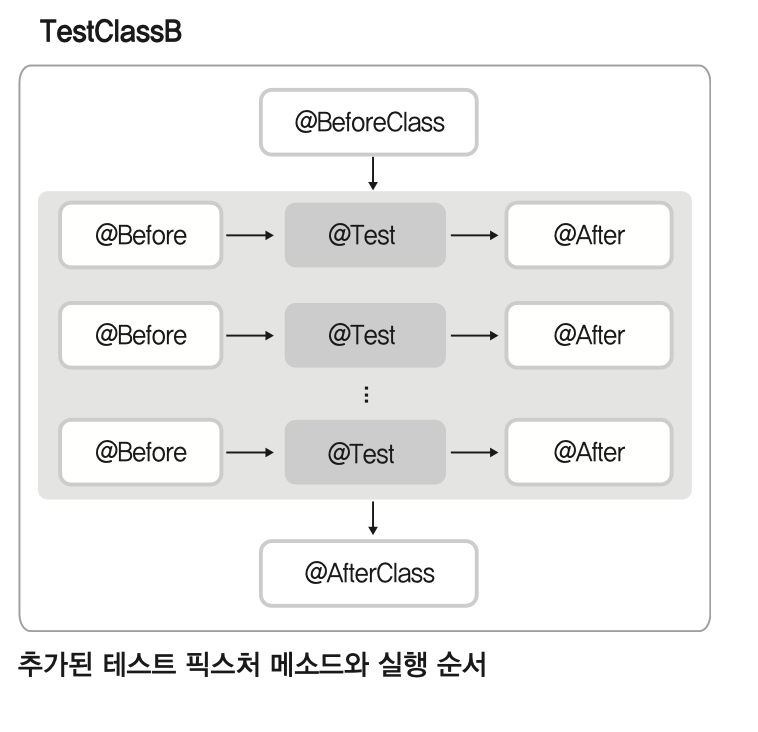
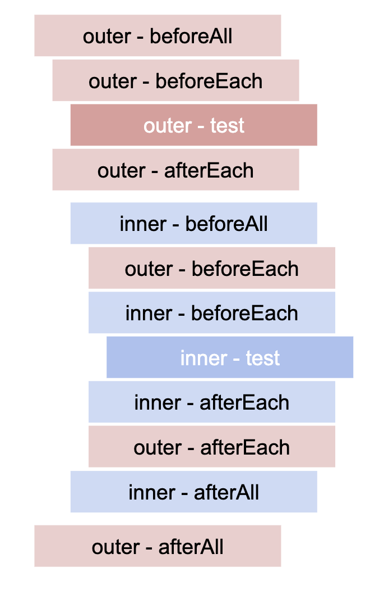

## 테스트 픽스처 메소드 추가 지원





```js
beforeAll(() => console.log('outer - beforeAll'));
afterAll(() => console.log('outer - afterAll'));
beforeEach(() => console.log('outer - beforeEach'));
afterEach(() => console.log('outer - afterEach'));

test('Outer test', () => console.log('outer - test'));

describe('Scoped / Nested block', () => {
  beforeAll(() => console.log('inner - beforeAll'));
  afterAll(() => console.log('inner - afterAll'));
  beforeEach(() => console.log('inner - beforeEach'));
  afterEach(() => console.log('inner - afterEach'));

  test('Inner test', () => console.log('inner - test'));
});

// outer - beforeAll
// outer - beforeEach
// outer - test
// outer - afterEach
// inner - beforeAll
// outer - beforeEach
// inner - beforeEach
// inner - test
// inner - afterEach
// outer - afterEach
// inner - afterAll
// outer - afterAll
```
